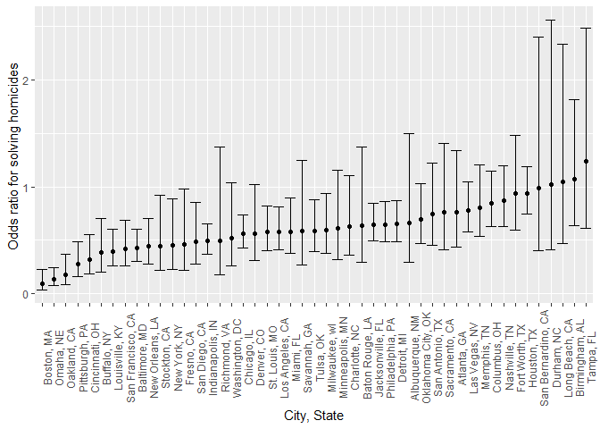

Homework 6
================
Krishna Vemulapalli

``` r
library(tidyverse)
library(ggplot2)
library(knitr)
library(janitor)
library(broom)
library(purrr)
```

## Problem 1

Reading and cleaning the dataset

``` r
homocide_df = read.csv("data/homocide-data.csv", na = c("", "NA", "Unknown")) %>%
  mutate(
    city_state = str_c(city, state, sep = ", "), #creating the city_state variable
    victim_age = as.numeric(victim_age), #changing the data type of age to numeric
    status = case_when(
      disposition == "Closed without arrest" ~ 0,
      disposition == "Open/No arrest" ~ 0,
      disposition == "Closed by arrest" ~ 1)) %>% #creating the status variable
  filter(victim_race == "White" |
         victim_race == "Black") %>% #subsetting data associated with white/black race
  filter(city_state != "Tulsa, AL") %>% #removing the data associated with Tulsa, AL
  mutate(
    victim_race = as.factor(victim_race),
    victim_race = fct_relevel(victim_race, "Black", after = 1)
    ) %>% #changing reference group to white
  select(city_state, status, victim_age, victim_sex, victim_race) %>%
  clean_names()
```

Performing logistic regression with resolved vs unresolved as the
outcome and victim age, sex and race as predictors for Baltimore, MD

``` r
baltimore_df = 
  homocide_df %>%
  filter(city_state == "Baltimore, MD") #filtering dataset to contain only baltimore data

glm(status ~ victim_age + victim_sex + victim_race, 
    data = baltimore_df, 
    family = binomial()) %>% #applying logistic regression
  tidy() %>%
  mutate(
    odds_ratio = exp(estimate),
    lower_CI = exp(estimate - 1.96 * std.error),
    upper_CI = exp(estimate + 1.96 * std.error)
  ) %>% #creating OR, lower and upper CI variables
  select(term, estimate, odds_ratio, lower_CI, upper_CI) %>%
  filter(term == "victim_raceBlack") %>% #comparing black victims to white victims
  kable(digits = 3)
```

| term              | estimate | odds\_ratio | lower\_CI | upper\_CI |
| :---------------- | -------: | ----------: | --------: | --------: |
| victim\_raceBlack |  \-0.842 |       0.431 |     0.306 |     0.607 |

Performing logistic regression for all the cities in the dataframe

``` r
lg_output_df = homocide_df %>%
  nest(data = -city_state) %>% #nesting the data without city_state into a data variable
  mutate(
    models = 
      map(.x = data, 
                 ~glm(status ~ victim_age + victim_sex + victim_race, 
                      data = .x, 
                      family = binomial())), #creating models for each city
    output = map(models, tidy)
  ) %>%
  select(city_state, output) %>% #subsetting to a dataframe with city_state and output
  unnest(output) %>% #unnesting
  mutate(
    odds_ratio = exp(estimate),
    lower_CI = exp(estimate - 1.96 * std.error),
    upper_CI = exp(estimate + 1.96 * std.error)
  ) %>% 
  select(city_state, term, odds_ratio, lower_CI, upper_CI) %>%
  filter(term == "victim_raceBlack") #comparing black victims to white victims
```

``` r
lg_output_df %>%
  mutate(city_state = fct_reorder(city_state, odds_ratio)) %>%
  ggplot(aes(x = city_state, y = odds_ratio)) +
  geom_point() +
  geom_errorbar(aes(ymin = lower_CI, ymax = upper_CI)) +
  theme(axis.text.x = element_text(angle = 90)) +
  ylab("Odds ratio for solving homicides ") + 
  xlab("City, State")
```

<!-- -->

## Problem 2
