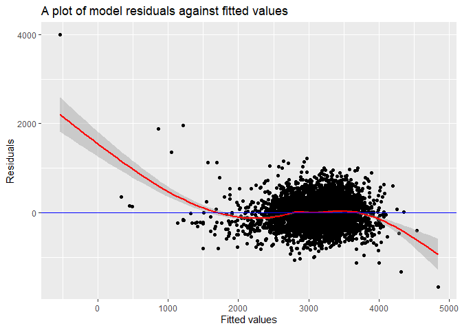
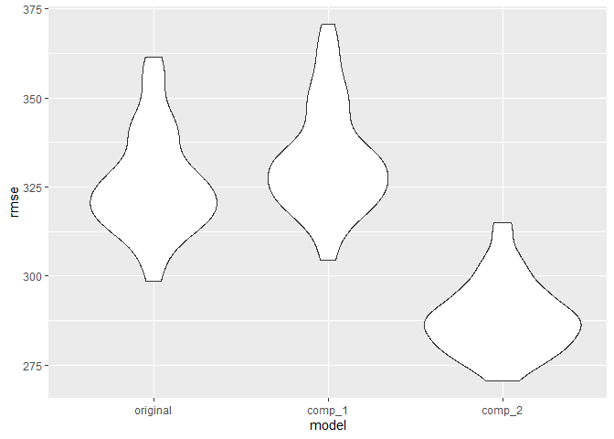

Homework 6
================
Krishna Vemulapalli

``` r
library(tidyverse)
library(ggplot2)
library(knitr)
library(janitor)
library(broom)
library(purrr)
library(modelr)
```

## Problem 1

Reading and cleaning the dataset

``` r
homocide_df = read.csv("data/homocide-data.csv", na = c("", "NA", "Unknown")) %>%
  mutate(
    city_state = str_c(city, state, sep = ", "), #creating the city_state variable
    victim_age = as.numeric(victim_age), #changing the data type of age to numeric
    status = case_when(
      disposition == "Closed without arrest" ~ 0,
      disposition == "Open/No arrest" ~ 0,
      disposition == "Closed by arrest" ~ 1)) %>% #creating the status variable
  filter(victim_race == "White" |
         victim_race == "Black") %>% #subsetting data associated with white/black race
  filter(city_state != "Tulsa, AL") %>% #removing the data associated with Tulsa, AL
  mutate(
    victim_race = as.factor(victim_race),
    victim_race = fct_relevel(victim_race, "Black", after = 1)
    ) %>% #changing reference group to white
  select(city_state, status, victim_age, victim_sex, victim_race) %>%
  clean_names()
```

Performing logistic regression with resolved vs unresolved as the
outcome and victim age, sex and race as predictors for Baltimore, MD

``` r
baltimore_df = 
  homocide_df %>%
  filter(city_state == "Baltimore, MD") #filtering dataset to contain only baltimore data

glm(status ~ victim_age + victim_sex + victim_race, 
    data = baltimore_df, 
    family = binomial()) %>% #applying logistic regression
  tidy() %>%
  mutate(
    odds_ratio = exp(estimate),
    lower_CI = exp(estimate - 1.96 * std.error),
    upper_CI = exp(estimate + 1.96 * std.error)
  ) %>% #creating OR, lower and upper CI variables
  select(term, estimate, odds_ratio, lower_CI, upper_CI) %>%
  filter(term == "victim_raceBlack") %>% #comparing black victims to white victims
  kable(digits = 3)
```

| term              | estimate | odds\_ratio | lower\_CI | upper\_CI |
| :---------------- | -------: | ----------: | --------: | --------: |
| victim\_raceBlack |  \-0.842 |       0.431 |     0.306 |     0.607 |

Performing logistic regression for all the cities in the dataframe

``` r
lg_output_df = homocide_df %>%
  nest(data = -city_state) %>% #nesting the data without city_state into a data variable
  mutate(
    models = 
      map(.x = data, 
                 ~glm(status ~ victim_age + victim_sex + victim_race, 
                      data = .x, 
                      family = binomial())), #creating models for each city
    output = map(models, tidy)
  ) %>%
  select(city_state, output) %>% #subsetting to a dataframe with city_state and output
  unnest(output) %>% #unnesting
  mutate(
    odds_ratio = exp(estimate),
    lower_CI = exp(estimate - 1.96 * std.error),
    upper_CI = exp(estimate + 1.96 * std.error)
  ) %>% 
  select(city_state, term, odds_ratio, lower_CI, upper_CI) %>%
  filter(term == "victim_raceBlack") #comparing black victims to white victims
```

``` r
lg_output_df %>%
  mutate(city_state = fct_reorder(city_state, odds_ratio)) %>%
  ggplot(aes(x = city_state, y = odds_ratio)) +
  geom_point() +
  geom_errorbar(aes(ymin = lower_CI, ymax = upper_CI)) +
  theme(axis.text.x = element_text(angle = 90)) +
  ylab("Odds ratio for solving homicides ") + 
  xlab("City, State")
```

<!-- -->

## Problem 2

Reading and cleaning birthweight raw data

``` r
bw_df = read.csv("data/birthweight.csv", na = c("", "NA")) %>%
  mutate(
    babysex = as.factor(babysex),
    frace = as.factor(frace),
    malform = as.factor(malform),
    mrace = as.factor(mrace),
    wtgain = as.numeric(wtgain)) %>%
  clean_names()
```

From the journal article, “Factors influencing the birth weight in
normal pregnancy”, it can be understood that the following factors could
impact birthweight: sex of the baby, gestational age, mother’s height,
mother’s weight and mother’s weight gain during pregnancy.

Based on the article, a reasonable model will be as follows:  
bwt \~ babysex + gaweeks + mheight + delwt + ppbmi + wtgain

The variable ppwt was not included in the model due to its possible
correlation with ppbwi.

``` r
model_original = lm(bwt ~ babysex + gaweeks + blength + mheight + delwt + ppbmi +wtgain,
                    data = bw_df)

model_original %>% 
  tidy() %>%
  kable()
```

| term        |      estimate |  std.error |   statistic |   p.value |
| :---------- | ------------: | ---------: | ----------: | --------: |
| (Intercept) | \-5873.724538 | 783.475764 | \-7.4970086 | 0.0000000 |
| babysex2    |   \-18.941170 |   9.987369 | \-1.8965124 | 0.0579588 |
| gaweeks     |     25.658420 |   1.692086 |  15.1637819 | 0.0000000 |
| blength     |    121.813982 |   2.016512 |  60.4082481 | 0.0000000 |
| mheight     |     25.325943 |  12.274613 |   2.0632784 | 0.0391456 |
| delwt       |    \-2.526466 |   3.083779 | \-0.8192761 | 0.4126740 |
| ppbmi       |     24.284316 |  17.764376 |   1.3670233 | 0.1716889 |
| wtgain      |      7.306983 |   3.117626 |   2.3437652 | 0.0191351 |

A plot of model residuals against fitted values is as follows:

``` r
bw_df = bw_df %>%
  add_residuals(model_original)

bw_df = bw_df %>%
  add_predictions(model_original)

bw_df %>%
  ggplot(aes(x = pred, y = resid)) + 
  geom_point() +
  geom_smooth(colour = "red") +
  geom_hline(yintercept = 0, colour = "blue") +
  labs(title = "A plot of model residuals against fitted values") +
  xlab("Fitted values") +
  ylab("Residuals") 
```

    ## `geom_smooth()` using method = 'gam' and formula 'y ~ s(x, bs = "cs")'

<!-- -->

Creating models for comparison

Comparison Model 1:

``` r
model_comp_1 = lm(bwt ~ blength + gaweeks,
                     data = bw_df)

model_comp_1 %>% 
  tidy() %>%
  kable()
```

| term        |     estimate | std.error |  statistic | p.value |
| :---------- | -----------: | --------: | ---------: | ------: |
| (Intercept) | \-4347.66707 | 97.958360 | \-44.38281 |       0 |
| blength     |    128.55569 |  1.989891 |   64.60439 |       0 |
| gaweeks     |     27.04673 |  1.717930 |   15.74379 |       0 |

Comparison Model 2:

``` r
model_comp_2 = lm(bwt ~ bhead*blength*babysex,
                     data = bw_df)

model_comp_2 %>% 
  tidy() %>%
  kable()
```

| term                   |       estimate |    std.error |   statistic |   p.value |
| :--------------------- | -------------: | -----------: | ----------: | --------: |
| (Intercept)            | \-7176.8170221 | 1264.8397394 | \-5.6740920 | 0.0000000 |
| bhead                  |    181.7956350 |   38.0542051 |   4.7772811 | 0.0000018 |
| blength                |    102.1269235 |   26.2118095 |   3.8962180 | 0.0000992 |
| babysex2               |   6374.8683508 | 1677.7669213 |   3.7996150 | 0.0001469 |
| bhead:blength          |    \-0.5536096 |    0.7802092 | \-0.7095656 | 0.4780117 |
| bhead:babysex2         |  \-198.3931810 |   51.0916850 | \-3.8830816 | 0.0001047 |
| blength:babysex2       |  \-123.7728875 |   35.1185360 | \-3.5244319 | 0.0004288 |
| bhead:blength:babysex2 |      3.8780531 |    1.0566296 |   3.6702106 | 0.0002453 |

The models will be plotted in order to get intuition for goodness of fit

``` r
bw_df %>%
  select(-c(resid, pred)) %>%
  gather_predictions(model_original, model_comp_1, model_comp_2) %>%
  mutate(model = fct_inorder(model)) %>%
  ggplot(aes(x = blength, y = bwt)) +
  geom_point(alpha = .5) +
  geom_line(aes(y = pred), color = "red") + 
  facet_grid(~model)
```

<!-- -->

Since the above plot doesn’t give a clear idea, we will use the
prediction errors (RMSE) to compare these three models using the cross
validation technique.

``` r
cv_df = 
  bw_df %>%
  select(-c(resid, pred)) %>% 
  crossv_mc(100) %>%
  mutate(
    train = map(train, as_tibble),
    test = map(test, as_tibble)
  )
  
cv_df = 
  cv_df %>%
  mutate(
    mod_org  = map(.x = train, ~lm(bwt ~ babysex + gaweeks + blength + mheight + delwt + ppbmi +wtgain,data = .x)),
    mod_comp_1  = map(.x = train, ~lm(bwt ~ blength + gaweeks, data = .x)),
    mod_comp_2  = map(.x = train, ~lm(bwt ~ bhead*blength*babysex, data = .x))
    ) %>% 
  mutate(
    rmse_original = map2_dbl(.x = mod_org,.y = test, ~rmse(model = .x, data = .y)),
    rmse_comp_1   = map2_dbl(.x = mod_comp_1,.y = test, ~rmse(model = .x, data = .y)),
    rmse_comp_2 = map2_dbl(.x = mod_comp_2,.y = test, ~rmse(model = .x, data = .y))
    )
```

We will now plot the prediction error distribution for each model. This
plot will assist in visually comparing the three models.

``` r
cv_df %>% 
  select(starts_with("rmse")) %>% 
  pivot_longer(
    everything(),
    names_to = "model", 
    values_to = "rmse",
    names_prefix = "rmse_") %>% 
  mutate(model = fct_inorder(model)) %>% 
  ggplot(aes(x = model, y = rmse)) + geom_violin()
```

<!-- -->

Based on the above plot, we can clearly observe that the third model
(with head circumference, length, sex, and all possible interactions
terms) has the lowest distribution of RMSE when compared to the other
models. However, the third model is relatively more complex and
difficult to interpret. So, the best model can’t be decided very easily
and it depends on the context. The third model would be more efficient
for the prediction purpose, but for interpretation purpose we might have
to choose a different model.

## Problem 3

### References

  - <https://www.ajog.org/article/0002-9378(65)90248-6/pdf#articleInformation>
